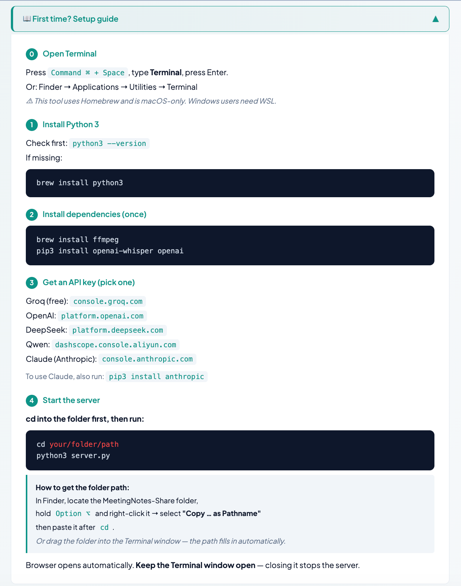
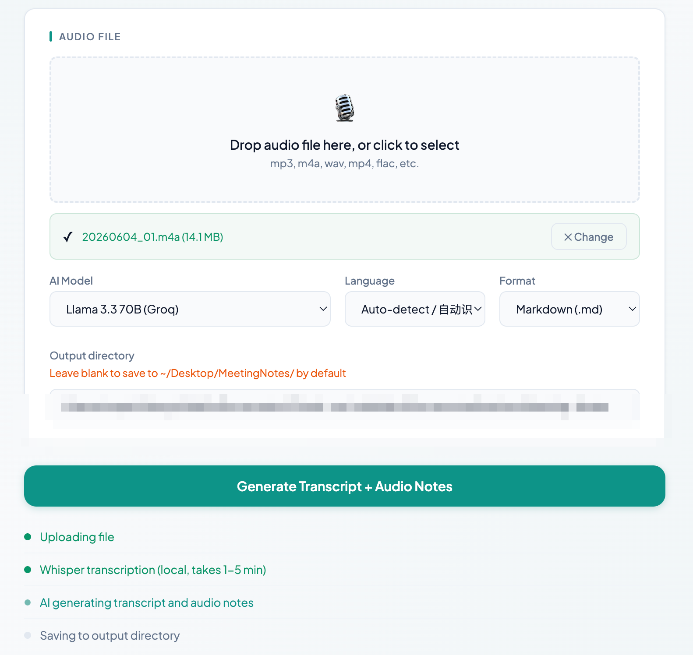
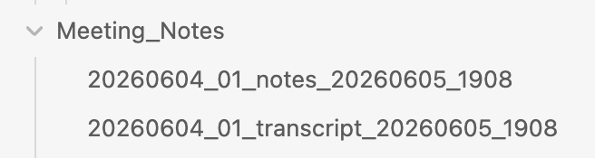
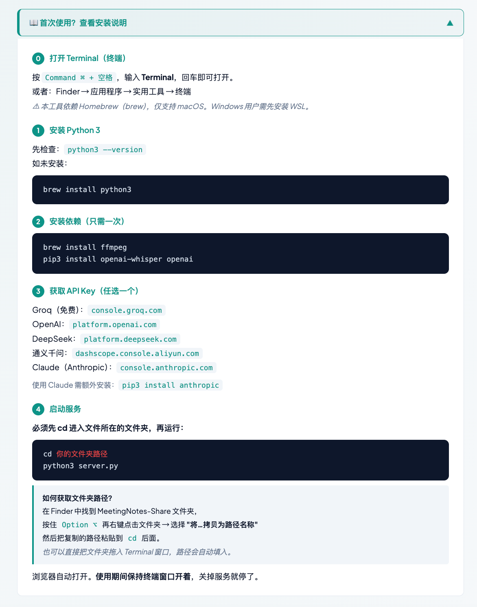
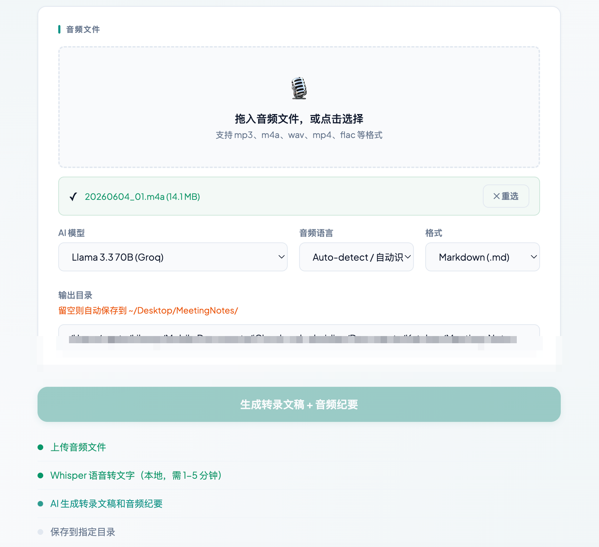

# Meeting Notes Generator · 会议纪要生成工具

[English](#english) · [中文](#中文)

---

## English

### Why I built this

Apple Voice Memos has a built-in transcription feature — but it doesn't support Chinese. I tried everything: enabling Dictation, switching input methods, changing keyboard settings. Nothing worked. And every tool I found online either charged a subscription fee or required uploading my audio to someone else's server.

So I built this: a free, local tool that transcribes audio using [Whisper](https://github.com/openai/whisper) (runs on your machine, audio never leaves), then sends only the transcript text to an AI model of your choice to generate structured meeting notes.

### What it does

Upload a recording → local Whisper transcription → AI summary → saved as Markdown or plain text.

Whisper supports 90+ languages. The UI and output language switch between English and Chinese.

### Screenshots







### Setup

**1. Install Python 3**

Check first: `python3 --version`  
If missing: download from [python.org/downloads](https://www.python.org/downloads/)

**2. Install dependencies**

```bash
brew install ffmpeg        # macOS
pip3 install openai-whisper openai
```

**3. Get an API key (pick one)**

| Provider | Free tier | Link |
|----------|-----------|------|
| Groq | ✅ Free | console.groq.com |
| OpenAI | Paid | platform.openai.com |
| DeepSeek | Low cost | platform.deepseek.com |
| Qwen | Free quota | dashscope.console.aliyun.com |
| Claude (Anthropic) | Paid | console.anthropic.com |

> Using Claude requires an extra package: `pip3 install anthropic`

> **Note:** Some providers (OpenAI, Anthropic) may be inaccessible in certain regions. If a provider doesn't work, try switching to another — Groq is free and broadly accessible.

**4. Start**

```bash
cd /path/to/MeetingNotes-Share
python3 server.py
```

Browser opens automatically at `http://localhost:5001`. Keep the Terminal window open while using.

### Usage

1. Enter your API key in the UI
2. Choose a model from the dropdown
3. Upload your audio file (mp3, m4a, wav, mp4, flac…)
4. Set output directory and format, click **Generate Meeting Notes**

Notes are saved to the directory you specified (defaults to `~/Desktop/MeetingNotes/`).

### Windows (limited support)

The Python code is cross-platform. To run on Windows:

1. Install Python 3 from [python.org/downloads](https://www.python.org/downloads/)
2. Install ffmpeg: `winget install ffmpeg` (or download from [ffmpeg.org](https://ffmpeg.org/download.html) and add to PATH)
3. Install Python packages: `pip install openai-whisper openai`
4. Run: `python server.py`

> Windows support is not officially tested. If you run into issues, feel free to open an issue.

### Notes

- Transcription runs **locally** via Whisper — audio never leaves your machine.
- Only the transcript text is sent to the AI API.
- First run downloads the Whisper model (~140 MB).
- The server is single-threaded; one job at a time.

---

Built by [katchen.me](https://katchen.me/)

---

## 中文

### 为什么做这个

苹果的 Voice Memos 内置了转录功能，但不支持中文。我把能试的都试了：打开听写、切换输入法、改键盘设置，全都没用。网上找到的语音转文字工具，要么收费订阅，要么需要把录音上传到别人的服务器。

于是我自己做了这个：免费，本地转录，不上传录音。用 [Whisper](https://github.com/openai/whisper) 在你的电脑上完成语音识别，只把转录出来的文字发给 AI 生成结构化纪要。

### 功能

上传录音 → Whisper 本地转录 → AI 生成结构化纪要 → 保存为 Markdown 或纯文本。

Whisper 支持 90+ 种语言。界面和输出语言可在中文/英文之间切换。

### 截图






### 安装

**1. 安装 Python 3**

先检查：`python3 --version`  
如未安装：`brew install python3` 或从 [python.org/downloads](https://www.python.org/downloads/) 下载

**2. 安装依赖**

```bash
brew install ffmpeg
pip3 install openai-whisper openai
```

**3. 获取 API Key（选一个即可）**

| 服务商 | 免费额度 | 链接 |
|--------|----------|------|
| Groq | ✅ 免费 | console.groq.com |
| OpenAI | 付费 | platform.openai.com |
| DeepSeek | 低价 | platform.deepseek.com |
| 通义千问 (Qwen) | 免费额度 | dashscope.console.aliyun.com |
| Claude (Anthropic) | 付费 | console.anthropic.com |

> 使用 Claude 需额外安装：`pip3 install anthropic`

> **提示：** 部分服务商（如 OpenAI、Anthropic）在某些地区可能无法访问。如遇连接失败，建议切换其他服务商——Groq 免费且访问限制较少。

**4. 启动**

```bash
cd /你的路径/MeetingNotes-Share
python3 server.py
```

浏览器自动打开 `http://localhost:5001`。使用期间保持终端窗口开着。

> **如何获取文件夹路径：** 在 Finder 中，按住 `Option ⌥` 右键点击文件夹 → **"将…拷贝为路径名称"**，或直接把文件夹拖入终端窗口。

### 使用方法

1. 在界面中输入 API Key
2. 从下拉菜单选择模型
3. 上传音频文件（mp3、m4a、wav、mp4、flac……）
4. 设置保存目录和格式，点击 **生成会议纪要**

纪要保存到你指定的目录（默认 `~/Desktop/MeetingNotes/`）。

### Windows（有限支持）

Python 代码本身跨平台，Windows 上运行步骤：

1. 从 [python.org/downloads](https://www.python.org/downloads/) 安装 Python 3
2. 安装 ffmpeg：`winget install ffmpeg`（或从 [ffmpeg.org](https://ffmpeg.org/download.html) 下载并加入 PATH）
3. 安装 Python 依赖：`pip install openai-whisper openai`
4. 运行：`python server.py`

> Windows 未经官方测试，如有问题欢迎提 issue。

### 说明

- 转录在本地完成，录音不会上传到任何服务器。
- 只有文字转录结果会发送给 AI API。
- 首次运行会下载 Whisper 模型（约 140 MB）。
- 服务器是单线程的，一次处理一个任务。

---

作者：[katchen.me](https://katchen.me/)
